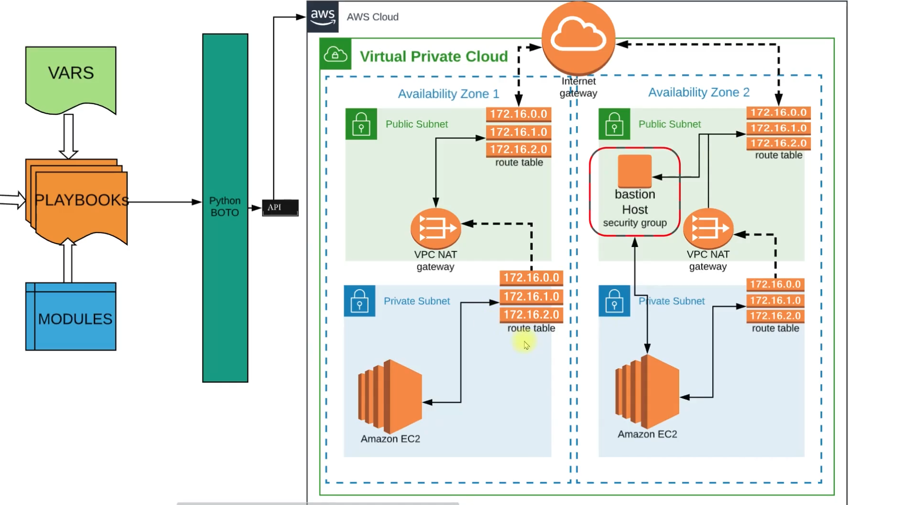

# Cloud Automation with Ansible

## Scenario
As part of the AWS Cloud Management Team, I regularly deploy and set up infrastructure on the cloud. For every new project, I make sure to use a secure and highly available (HA) VPC. I often handle regular requests for cloud resources and configurations.

## Problem
When I work with VPCs, I deal with many moving parts—subnets, NAT gateways, internet gateways, route tables, network ACLs, and security groups. I also need to set up a bastion host for secure access. If I make a mistake, it can lead to a non-functional or exposed VPC, which is a serious risk. Managing all these components manually is a time-consuming task, and I want to avoid human error as much as possible.

## Solution
To address these challenges, I use configuration management for my VPCs. By automating the setup, I eliminate human errors and ensure everything is consistent. I centralize change management, so every update is tracked and controlled. With version control and Infrastructure as Code (IaC), I can easily manage, review, and roll back changes as needed.

## Statistics: Cloud Automation in IT
By adopting cloud automation, I’ve seen significant benefits:
- 71%: I experience 10% revenue growth.
- 84%: I increase revenue and lower operations costs.
- 81%: I become more innovative in my IT practices.
- 84%: I am more agile and can respond to changes faster.

## Tool and Cloud
I rely on Ansible automation for configuration management of my VPCs. On the AWS Cloud Platform, I set up VPCs with bastion hosts to ensure secure and efficient access.

## Overview
I created this project to demonstrate how I can automate cloud infrastructure provisioning and management using [Ansible](https://www.ansible.com/). Ansible is my go-to open-source automation tool for simplifying configuration management, application deployment, and task automation across servers and cloud environments.

## Features
- I can automate cloud resource provisioning
- I manage infrastructure as code
- I use reusable and modular playbooks
- I easily integrate with various cloud providers

## Prerequisites
Before I get started, I make sure I have:
- [Python 3.6+](https://www.python.org/downloads/)
- [Ansible](https://docs.ansible.com/ansible/latest/installation_guide/intro_installation.html)
- Access to my preferred cloud provider (AWS, Azure, GCP, etc.)
- My cloud provider credentials (API keys, secrets, etc.)

## Setup
1. **Clone the repository:**
   ```bash
   git clone <repo-url>
   cd Cloud_Automation-Ansible
   ```
   I start by cloning the repository and navigating into the project directory.
2. **Install Ansible:**
   ```bash
   pip install ansible
   ```
   I install Ansible using pip to get all the necessary automation tools.
3. **Configure my cloud credentials:**
   - I follow my cloud provider's documentation to set up credentials.
   - I export credentials as environment variables or use Ansible vault for sensitive data.

## Usage
- I place my Ansible playbooks in the project directory.
- To run a playbook, I use:
  ```bash
  ansible-playbook <playbook.yml>
  ```
- For example, I might run:
  ```bash
  ansible-playbook provision_infrastructure.yml
  ```

## Setup and Installation Log

Here’s how I set up my EC2 instance and installed Ansible for cloud automation:

### SSH Connection
- I created an EC2 instance using the Ubuntu 24.04 AMI.
- I used my public IP and `.pem` key to connect:
  ```bash
  cd /Users/varagantibasanthkumar/Desktop
  chmod 400 ansible-ohio-key.pem
  ssh -i ansible-ohio-key.pem ubuntu@18.191.203.32
  ```
- Once connected, I saw the Ubuntu shell prompt:
  ```
  ubuntu@ip-172-31-47-122:~$
  ```

### Installing Ansible
- I tried to install Ansible using user data, but it wasn’t present after boot.
- I manually ran:
  ```bash
  sudo apt update
  sudo apt install ansible -y
  ```
- I encountered network errors because my instance couldn’t reach the Ubuntu repositories.

### Troubleshooting Network Issues
- I checked my security group and ensured SSH was allowed from my IP.
- I updated the **outbound rules** to allow all traffic (0.0.0.0/0).
- After fixing the outbound rule, I was able to update and install packages.

### Verifying Ansible Installation
- I checked the Ansible version:
  ```bash
  ansible --version
  ```
- Output:
  ```
  ansible [core 2.16.3]
    config file = None
    configured module search path = ['/home/ubuntu/.ansible/plugins/modules', '/usr/share/ansible/plugins/modules']
    ansible python module location = /usr/lib/python3/dist-packages/ansible
    ansible collection location = /home/ubuntu/.ansible/collections:/usr/share/ansible/collections
    executable location = /usr/bin/ansible
    python version = 3.12.3 (main, Feb  4 2025, 14:48:35) [GCC 13.3.0] (/usr/bin/python3)
    jinja version = 3.1.2
    libyaml = True
  ```
- Ansible is now ready to use for automating my cloud infrastructure!

## AWS CLI Installation and Verification

To interact with AWS from my EC2 instance, I installed and configured the AWS CLI:

### Installing AWS CLI
- I attempted to install AWS CLI using apt, but the package was not available.
- Instead, I used the official AWS CLI installer script:
  ```bash
  curl "https://awscli.amazonaws.com/awscli-exe-linux-x86_64.zip" -o "awscliv2.zip"
  sudo apt update
  sudo apt install unzip -y
  unzip awscliv2.zip
  sudo ./aws/install
  aws --version
  ```

### Verifying AWS CLI Configuration
- I verified my AWS CLI setup and IAM role with:
  ```bash
  aws sts get-caller-identity
  ```
- Output:
  ```json
  {
      "UserId": "AROA5FTZB6VPTSKO2G5VT:i-0c32ef1f11a001524",
      "Account": "905418241375",
      "Arn": "arn:aws:sts::905418241375:assumed-role/ansible-admin/i-0c32ef1f11a001524"
  }
  ```
- This confirms that my instance is authenticated as the IAM role `ansible-admin` and is ready for AWS automation tasks.

## Sample Playbook: Creating and Storing an EC2 Key Pair

Here’s a complete example of how I use Ansible to create an EC2 key pair, print the output, and save the private key to a PEM file:

```yaml
- hosts: localhost
  connection: local
  gather_facts: False
  tasks:
    - name: sample ec2 key
      ec2_key:
        name: sample
        region: us-east-2
      register: keyout

    - debug:
        var: keyout

    - name: store login key
      copy:
        content: "{{ keyout.key.private_key }}"
        dest: ./sample-key.pem
```

**Explanation:**
- I run this playbook locally.
- I use the `ec2_key` module to create a key pair named `sample` in the `us-east-2` region.
- I register the output as `keyout`.
- I print the output using the `debug` module.
- I store the private key in a file called `sample-key.pem` using the `copy` module, so I can use it to log in to my EC2 instances.

## Project Structure
```
Cloud_Automation-Ansible/
├── playbooks/           # Where I keep my Ansible playbooks
├── roles/               # My Ansible roles
├── inventory/           # Inventory files I use
├── group_vars/          # Group variables for my setup
├── host_vars/           # Host variables for my setup
└── README.md            # This documentation
```

## References
- [Ansible Documentation](https://docs.ansible.com/)
- [Ansible Cloud Modules](https://docs.ansible.com/ansible/latest/collections/amazon/aws/)

## License
I’ve licensed this project under the MIT License. 

## Architecture

I have included an architecture diagram to visually represent how I automate cloud infrastructure using Ansible and AWS. You can find the diagram below:



*The diagram illustrates the key components and flow of my automated cloud setup. (You can add a detailed description here based on the specific elements shown in your architecture.)* 